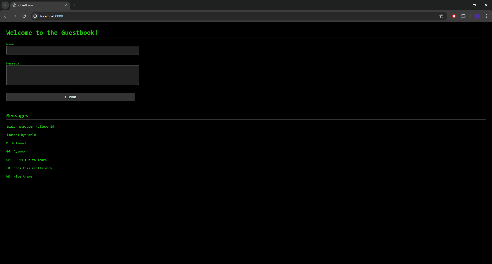

# A hacker theme, simplistic guest book built using Golang

I created a simple web-based guestbook with pure Golang. Users can leave messages that are stored in a .txt file and displayed on the homepage. This was a simple, clean project to learn more about backend web development with Go's standard library.

--- 

## Features

- Web form that users can submit entries
- Message are saved to a file (`messages.txt`) so they reload with the server
- All data is stored in memory and rendered using Go's `html/template` package
- Pitch black design with a "Hacker" like font color/style

---

## Why I made this project

I created this to give myself a intro to building web apps with Go. I wanted to understand:

- How to handle HTTP requests and routes
- How to parse and display HTML templates
- How to work with form submissions
- How to store and read data from a file

It was a good opportunity to practice clean code, file structure and some basic frontend styling.

---

## Tech Stack

- **Language:** Go (Golang)
- **Libraries:** Go standard library only (`net/http`, `html/template`, `os`)
- **Frontend:** HTML/CSS (inline styling)
- **Persistence:** Local file-based (`messages.txt`)

---

## Screenshot


---

## How to Run It

1. Make sure you have [Go Installed](https://go.dev/doc/install)
2. Clone this repo:
    ```bash
    git clone https://github.com/your-username/go-guestbook.git
    cd go-guestbook
3. Run the app:
    ```bash
    go run main.go
4. Visit http://localhost:8080 in your browser

---

MIT License. Feel free to fork and build on this!
